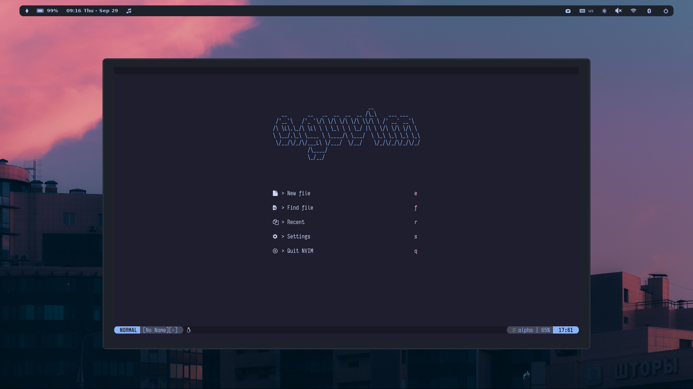

# *Aguvim*
Neovim configuration files.

## Dependencies
- [Neovim](https://github.com/neovim/neovim) ≥ v0.7
- [ripgrep](https://github.com/BurntSushi/ripgrep)
- [Lazy Git](https://github.com/jesseduffield/lazygit)
