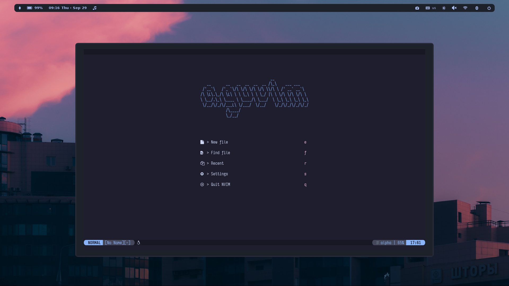

# *Aguvim*
Neovim configuration files.

## Dependencies

The following executables must be available on `$PATH`. Install them with the
package manager appropriate for your macOS or Linux system.

- [Neovim](https://github.com/neovim/neovim) >= v0.12
- [ripgrep](https://github.com/BurntSushi/ripgrep), required by Telescope's live grep
- [tree-sitter CLI](https://github.com/tree-sitter/tree-sitter) >= v0.26.1
- [LazyGit](https://github.com/jesseduffield/lazygit)
- [fd](https://github.com/sharkdp/fd), optional alternative file finder for Telescope
